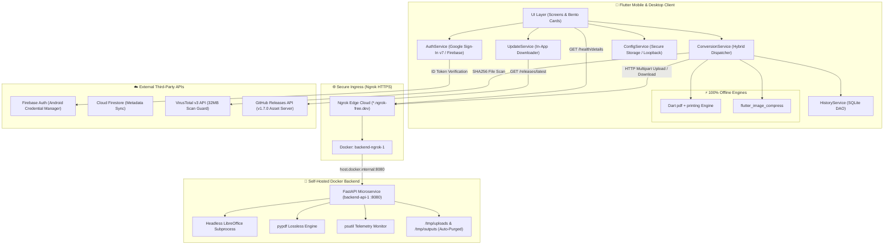
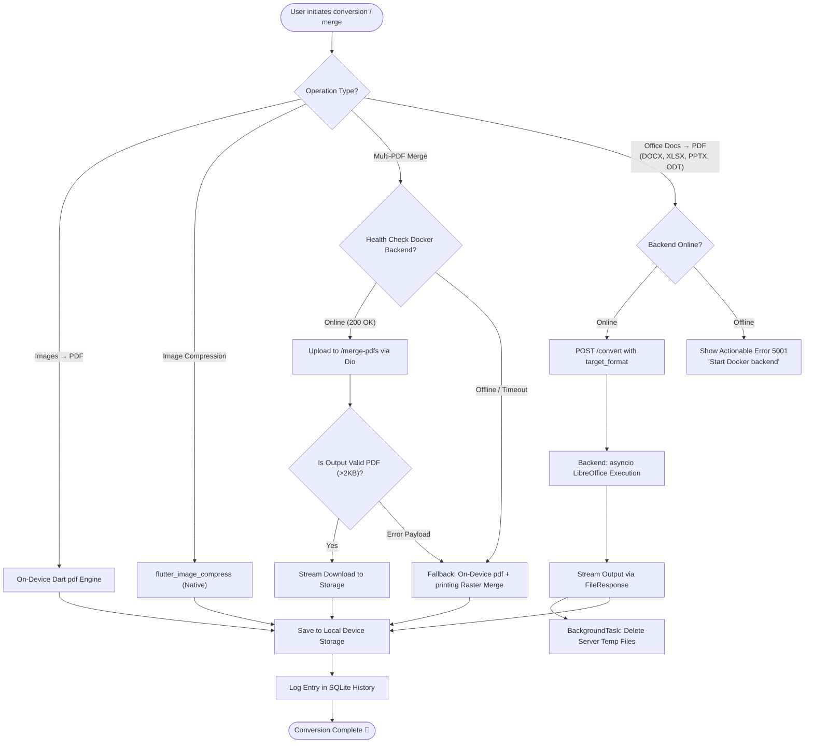
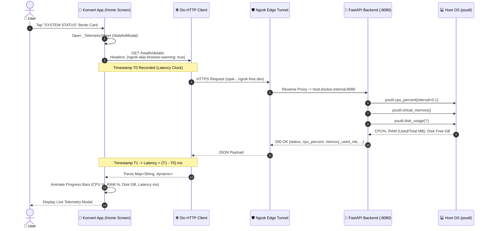
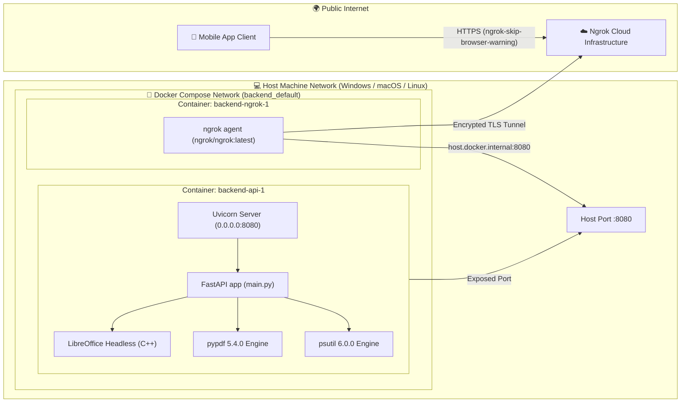
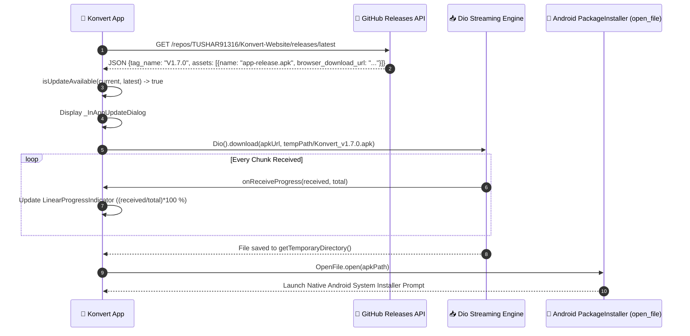
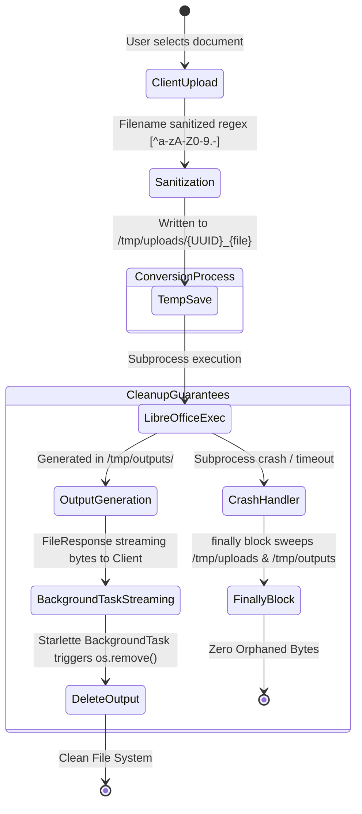

# Konvert — System Architecture & Technical Deep Dive 🏗️

  

This document provides a comprehensive, in-depth architectural breakdown of **Konvert** (v1.7.0). It covers the hybrid engine mechanics, real-time telemetry pipeline, Docker multi-container topology, and zero-trust security model.

---

## 📑 Table of Contents
1. [High-Level System Topology](#1-high-level-system-topology)
2. [Hybrid Conversion Decision Engine](#2-hybrid-conversion-decision-engine)
3. [Real-Time Telemetry & Health Monitoring](#3-real-time-telemetry--health-monitoring)
4. [Multi-Container Docker Network Topology](#4-multi-container-docker-network-topology)
5. [In-App APK Streaming & Native Installer](#5-in-app-apk-streaming--native-installer)
6. [Zero-Trust Security & Ephemeral Storage](#6-zero-trust-security--ephemeral-storage)
7. [Technology Stack Matrix](#7-technology-stack-matrix)

---

## 1. High-Level System Topology

---

## 2. Hybrid Conversion Decision Engine

Konvert operates on a **Fail-Safe Hybrid Pipeline**. Offline-capable tasks run directly on the device, while complex office document rendering and lossless multi-PDF merges are processed on the user's private Docker microservice with instant on-device fallbacks:

---

## 3. Real-Time Telemetry & Health Monitoring

The **System Status Bento Card** and **Telemetry Bottom Sheet** track the health, latency, and resource footprint of the Docker backend in real time:

---

## 4. Multi-Container Docker Network Topology

The backend runs as an isolated, self-healing Docker Compose network on the user's host machine:

---

## 5. In-App APK Streaming & Native Installer

Version 1.7.0 replaces external browser redirects with a seamless streaming downloader and native Android Package Installer invocation:

---

## 6. Zero-Trust Security & Ephemeral Storage

Konvert enforces a **strict zero-retention policy**. Files are never retained on the server once processing terminates:

---

## 7. Technology Stack Matrix

| Component | Technology | Version | Purpose |
|---|---|---|---|
| **Frontend Framework** | Flutter SDK | `3.38.3` | Multiplatform client UI and offline engines |
| **Dart Runtime** | Dart SDK | `3.10.x` | Modern null-safe asynchronous logic |
| **Build Toolchain** | Gradle / AGP | `8.14` / `8.11.1` | Android compilation target (compileSdk 37) |
| **Java Target** | OpenJDK | `Java 17` | Clean release builds with zero obsolete warnings |
| **Backend Framework** | FastAPI + Uvicorn | `0.115.5` / `0.32.1` | Async REST Microservice |
| **Office Conversion** | LibreOffice Headless | `7.x / 24.x` | High-fidelity document-to-PDF engine |
| **Server PDF Merger** | `pypdf` | `5.4.0` | Server-side lossless PDF page stream merger |
| **System Telemetry** | `psutil` | `6.0.0` | Real-time CPU %, RAM, and Disk inspection |
| **Ingress Tunneling** | Ngrok Docker | `latest` | Secure HTTPS static domain reverse proxy |
| **Authentication** | Google Sign-In | `7.2.0` | Android Credential Manager integration |
| **Local Database** | SQLite (`sqflite`) | `2.4.3` | Device-local history and offline logs |
| **Secure Keyring** | `flutter_secure_storage` | `9.2.4` | Encrypted theme, tokens, and backend URLs |

---

*Documented for Konvert v1.7.0+13*
