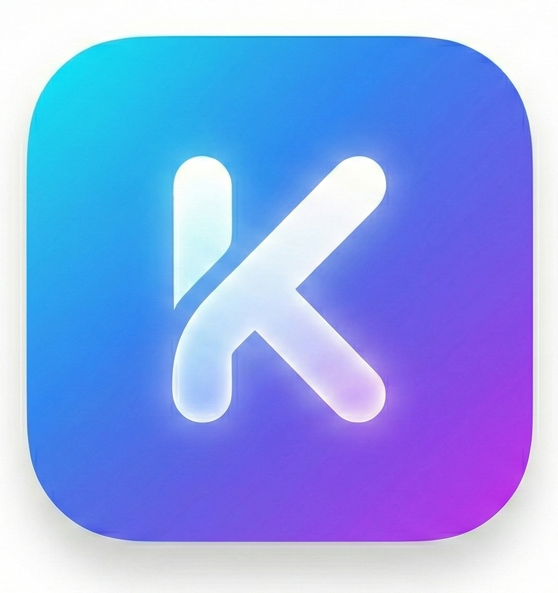

# Konvert - Advanced File Management & Conversion Tool

<p align="center">
  
</p>

Konvert is a hybrid, secure, and powerful mobile application designed to handle file conversions and compression with a focus on **User Privacy** and **Security**. Unlike typical web tools, Konvert processes sensitive files (like Images) locally on your device whenever possible.

## 🌟 Key Features

### 1. 🔄 Smart File Conversion
- **Hybrid Engine**: Automatically chooses the best way to convert your file.
    - **Local**: Images to PDF (Processed entirely on-device).
    - **Cloud**: complex docs (DOCX, XLSX, PPTX) are handled securely by our backend (LibreOffice).
- **Supported Formats**:
    - **Images**: JPG, PNG, WEBP, HEIC ➡️ PDF
    - **Documents**: DOC, DOCX, TXT, RTF, ODT, HTML ➡️ PDF
    - **Office**: XLS, XLSX, PPT, PPTX ➡️ PDF

### 2. 📉 Compression Studio
- **Compress Images**: Reduce image size efficiently.
    - **Quality Mode**: Reduce by percentage (e.g., 80% quality).
    - **Target Size Mode**: Specify your limit (e.g., "Max 500 KB"), and the app auto-optimizes.
- **Shrink Docs**: (Coming Soon) Optimize PDF file sizes.

### 3. 🛡️ Advanced Security
- **Auto-Scan Integration**: Connect your **VirusTotal API Key** in Settings.
- **Automatic Safety**: If enabled, files are strictly scanned for malware *before* any conversion starts.
- **Privacy First**: We don't store your files. Cloud conversions are temporary and deleted immediately after processing.

### 4. 📜 History & Management
- **Conversion History**: Keep track of all your past tasks.
- **Offline Access**: History is stored locally on your device.
- **Guest Mode**: Use the app without an account (limitations apply).

---

## 🆚 Konvert vs. Web Converters

Why download Konvert? It offers a **Hybrid** advantage:

| Feature | 🚀 Konvert App | 🌐 Typical Web Converter |
| :--- | :--- | :--- |
| **Images** (Privacy) | **100% Offline**: Processed on your phone. No upload. | **Online**: Must upload photos to server. |
| **Documents** (Docs/PPT) | **Secure Cloud**: Uploaded, processed, then **instantly deleted**. | **Unknown**: Files often stored for hours/days. |
| **Security** | **VirusTotal Auto-Scan** checks files before upload. | No virus scanning. |
| **Speed** | **Instant** for local tools (Images). | **Slow**: Dependent on upload speed. |
| **History** | **Local Log**: Keeps your history private on-device. | **None**: Data lost after closing tab. |
| **Ads** | **Ad-Free** experience. | **Cluttered**: Full of ads/popups. |

> **Note**: Document conversion (DOCX, PPTX) requires an internet connection to reach our secure helper backend. Image tools work completely offline.

---

## 🔧 Tech Stack

- **Frontend**: Flutter (Dart)
- **Backend**: Python (FastAPI) + LibreOffice (in Docker)
- **Security**: VirusTotal API + Flutter Secure Storage
- **Tools**: `flutter_image_compress`, `file_picker`, `firebase_auth`

## 🚀 Getting Started

1.  **Clone the repo**
2.  **Run Backend (Docker)**:
    ```bash
    docker run -p 8000:8000 konvert-backend
    ```
3.  **Run App**:
    ```bash
    flutter run
    ```
