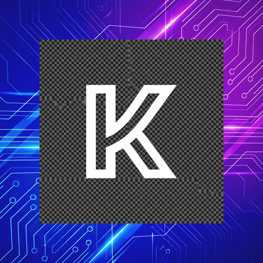
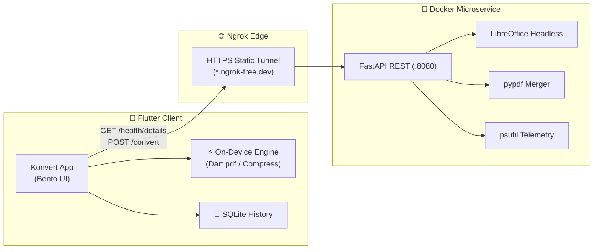

<div align="center">

# ⚡ Konvert
### High-Performance Hybrid File Converter, PDF Suite & Compression Studio

<p align="center">
  
</p>

<p align="center">
  <a href="https://konvert-website.vercel.app/"></a>
  <a href="https://www.amazon.in/PrivateByte-Labs-Konvert/dp/B0GDRZLHZ7/"></a>
  <a href="https://github.com/TUSHAR91316/Konvert/releases/latest"></a>
  <a href="ARCHITECTURE.md"></a>
</p>

<p align="center">
  <a href="https://github.com/TUSHAR91316/Konvert/actions/workflows/flutter_ci.yml"></a>
  <a href="https://github.com/TUSHAR91316/Konvert/actions/workflows/backend_ci.yml"></a>
  <a href="https://github.com/TUSHAR91316/Konvert/discussions"></a>
  <a href="https://github.com/TUSHAR91316/Konvert/issues"></a>
  <a href="LICENSE"></a>
</p>

**Konvert** is an advanced, privacy-first file manipulation platform that seamlessly bridges **100% on-device processing** with a **self-hosted Docker microservice**. Sensitive photos and files never leave your device, while complex office document rendering and lossless multi-PDF merging are executed on your private container and deleted immediately.

</div>

---

## 📑 Table of Contents
- [✨ Key Features](#-key-features)
- [🆚 Konvert vs. Cloud Web Converters](#-konvert-vs-cloud-web-converters)
- [🏗️ System Architecture](#-system-architecture)
- [🚀 Quickstart & Self-Hosting (1-Click Docker)](#-quickstart--self-hosting)
- [📱 Supported Formats](#-supported-formats)
- [🔧 Technology Stack](#-technology-stack)
- [🔄 CI/CD & Testing Pipeline](#-cicd--testing-pipeline)
- [🗺️ Product Roadmap](#-product-roadmap)
- [🤝 Community & Contributing](#-community--contributing)

---

## ✨ Key Features

### 1. 🔄 Hybrid Conversion Engine
* **⚡ 100% On-Device**: Convert photos, screenshots, and scans into PDFs completely offline without internet or server access.
* **🐳 Private Cloud Rendering**: Heavy office formats (`DOCX`, `XLSX`, `PPTX`, `ODT`, `HTML`) are processed in headless LibreOffice via your personal self-hosted Docker microservice.
* **📄 Lossless Multi-PDF Merge**: Merge multiple PDF documents with automatic fail-safe fallback between server `pypdf` and on-device Dart `pdf` rendering.

### 2. 📉 Native Compression Studio
* **Quality Preservation Mode**: Dial in custom visual fidelity percentages (e.g. 80% quality).
* **Target File Size Optimization**: Set a strict ceiling (e.g., *"Max 500 KB"*) and the intelligent engine calculates optimal dimensions and bitrates automatically.

### 3. 🛡️ Enterprise Security & Telemetry
* **VirusTotal API Scanner**: Auto-scan documents against 70+ antivirus engines before conversion.
* **Live System Telemetry**: View real-time CPU utilization, RAM consumption, available disk storage, and network latency directly in the mobile app.
* **Zero-Knowledge Privacy**: Server-side files are wiped immediately upon stream completion with background task garbage sweeps.

### 4. 📲 Seamless In-App APK Updater
* In-app streaming release downloader with instant progress bars and native Android Package Installer invocation (`open_file`).

---

## 🆚 Konvert vs. Cloud Web Converters

| Feature | 🚀 Konvert App | 🌐 Typical Online Converters |
| :--- | :--- | :--- |
| **Images & Photos** | **100% Offline**: Processed entirely on-device. Zero upload. | **Uploaded**: Transferred to third-party cloud servers. |
| **Office Documents** | **Self-Hosted**: Handled on your own Docker container, **wiped instantly**. | **Third-Party**: Often stored for 24+ hours or used for tracking. |
| **Malware Inspection** | **VirusTotal Pre-Scan**: Checks hashes before processing. | None. |
| **Ads & Popups** | **100% Ad-Free**: Clean, professional Bento UI. | **Heavy Ads**: Invasive ads, captchas, and paywalls. |
| **History & Storage** | **Encrypted Local Storage**: Stored privately on your device. | Lost on browser tab close or stored unencrypted. |

---

## 🏗️ System Architecture

Konvert combines an expressive Flutter client with an isolated Docker microservice tunneled through an encrypted Ngrok reverse proxy:



> 📖 **Deep Dive Documentation**: For detailed sequence diagrams, network topologies, telemetry lifecycles, and security models, see **[ARCHITECTURE.md](ARCHITECTURE.md)**.

---

## 🚀 Quickstart & Self-Hosting

Spin up your private conversion backend in less than 2 minutes using Docker Compose:

### 1. Download & Extract
Download **`backend.zip`** from the [GitHub Releases Page](https://github.com/TUSHAR91316/Konvert/releases/latest) (or clone this repository and open the `/backend` folder).

### 2. Configure `.env`
Rename `.env.example` to `.env` and add your free static Ngrok credentials from [dashboard.ngrok.com](https://dashboard.ngrok.com/):
```env
NGROK_AUTHTOKEN=your_free_ngrok_auth_token
NGROK_DOMAIN=your-static-domain.ngrok-free.app
```

### 3. Launch the Stack
```bash
docker-compose up -d --build
```

### 4. Connect the App
Open **Konvert** on your mobile device → Tap **Settings** → Paste your Ngrok URL (`https://your-static-domain.ngrok-free.app`) → You are ready to convert!

> 📘 For comprehensive deployment options (Standalone Docker, VPS, Portainer), consult **[SELF_HOSTING_101.md](SELF_HOSTING_101.md)**.

---

## 📱 Supported Formats

| Category | Input Formats | Target Outputs | Engine |
|---|---|---|---|
| **Images** | `JPG`, `PNG`, `WEBP`, `HEIC`, `BMP` | `PDF`, `Compressed Images` | ⚡ 100% On-Device |
| **Documents** | `DOC`, `DOCX`, `TXT`, `RTF`, `ODT`, `HTML` | `PDF` | 🐳 Self-Hosted Backend |
| **Presentations** | `PPT`, `PPTX` | `PDF` | 🐳 Self-Hosted Backend |
| **Spreadsheets** | `XLS`, `XLSX`, `ODS`, `CSV` | `PDF` | 🐳 Self-Hosted Backend |
| **PDF Operations** | Multiple `PDF` files | Merged `PDF` | ⚡ Hybrid (Backend + Offline) |

---

## 🔧 Technology Stack

* **Client**: [Flutter 3.x](https://flutter.dev) (Dart 3.x) with Material 3 Bento Card UI
* **Backend**: [FastAPI](https://fastapi.tiangolo.com/) + [Uvicorn](https://www.uvicorn.org/) (Python 3.12 Slim)
* **Document Converter**: LibreOffice 7.x / 24.x (Headless C++ runtime)
* **PDF Manipulation**: `pypdf` (Server) & Dart `pdf` / `printing` (Client fallback)
* **System Telemetry**: `psutil` real-time hardware monitoring
* **Secure Tunneling**: [Ngrok](https://ngrok.com/) Docker Agent (TLS reverse proxy)
* **Local Database**: SQLite (`sqflite`) + `flutter_secure_storage` (Hardware-backed keystore)
* **Authentication**: Firebase Auth + Google Sign-In v7 (Android Credential Manager)

---

## 🔄 CI/CD & Testing Pipeline

Every commit and pull request is automatically verified through GitHub Actions:

| Workflow | Status | Description |
|---|---|---|
| **Flutter CI** | [](https://github.com/TUSHAR91316/Konvert/actions/workflows/flutter_ci.yml) | Runs `flutter analyze --fatal-infos`, unit/widget test suites, and compiles release APK binaries. |
| **Docker Backend CI** | [](https://github.com/TUSHAR91316/Konvert/actions/workflows/backend_ci.yml) | Lints Python code (`flake8`), builds Docker container, and tests `/health` smoke endpoints. |

### Local Quality Hooks
Konvert enforces automated pre-commit and pre-push Git hooks:
* `pre-commit`: Runs `flutter analyze --fatal-infos` before committing.
* `pre-push`: Runs full `flutter test` suite before pushing to remote.

---

## 🗺️ Product Roadmap

* **v1.7.1**: PDF Manipulation Suite (Splitter, Rotator, Watermark) + Network Diagnostic Wizard.
* **v1.7.2**: On-Device OCR (Image-to-Text via MLKit) + Batch Image Converter.
* **v1.7.3**: PDF → DOCX / XLSX Reverse Converters + PDF Compression & Password Encryption.
* **v1.7.4**: Widescreen Layout Abstraction & Desktop FFI Preparation.
* **v2.0.0**: Official PC Launch (Windows/macOS) + Personal Docker Sync Vault.
* **v1.8.0**: AI Document Intelligence Suite + Dedicated System Workspace Folder.

> 📌 View the complete technical backlog and risk analysis in **[ROADMAP.md](ROADMAP.md)**.

---

## 🤝 Community & Contributing

* 🐛 **Found a Bug?** Open a [Bug Report](https://github.com/TUSHAR91316/Konvert/issues/new?template=bug_report.yml).
* 💡 **Have a Feature Idea?** Submit a [Feature Request](https://github.com/TUSHAR91316/Konvert/issues/new?template=feature_request.yml) or join the [Discussions](https://github.com/TUSHAR91316/Konvert/discussions).
* 🐳 **Self-Hosting Questions?** Check [SELF_HOSTING_101.md](SELF_HOSTING_101.md) or open a [Self-Hosting Ticket](https://github.com/TUSHAR91316/Konvert/issues/new?template=self_hosting_backend.yml).

---

<p align="center">
  Crafted with ❤️ by <b>PrivateByte Labs</b> | Built for Speed, Privacy & Precision.
</p>
